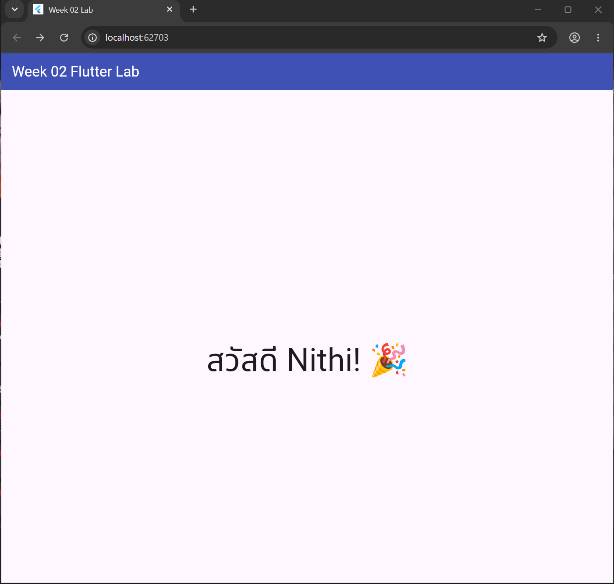
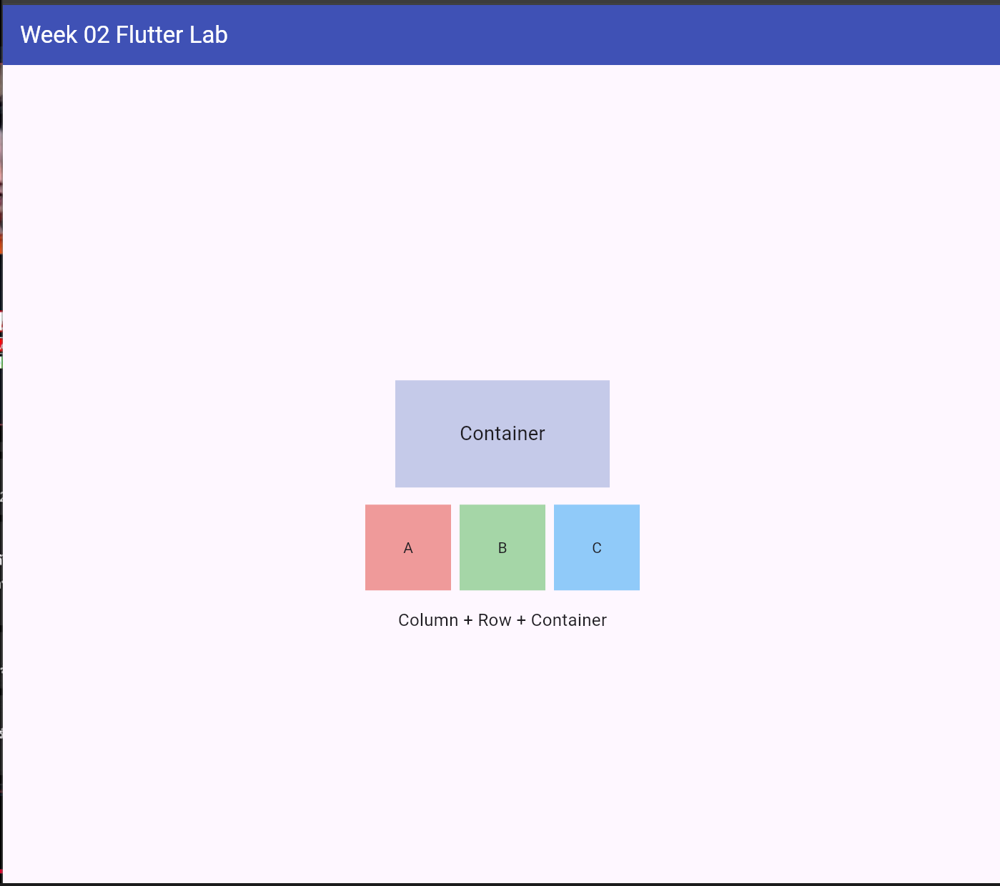
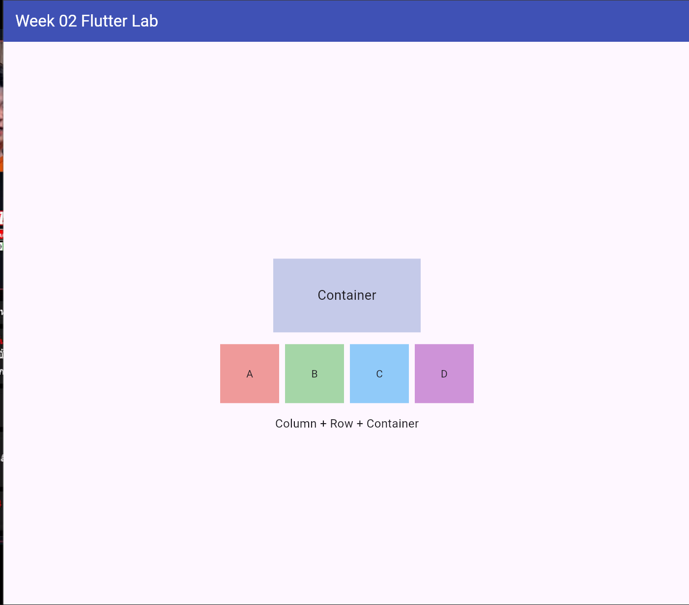
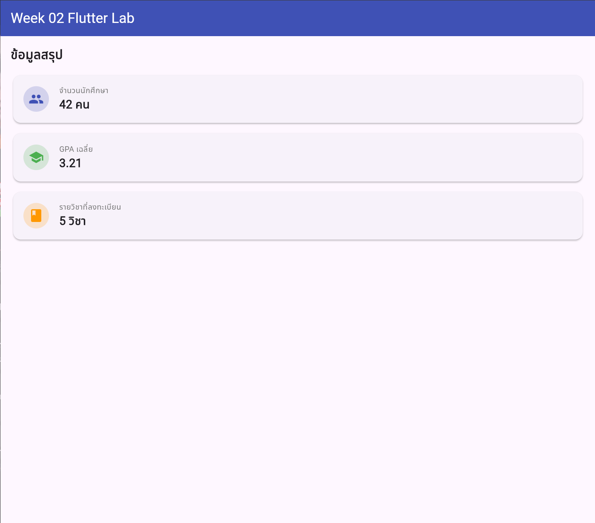
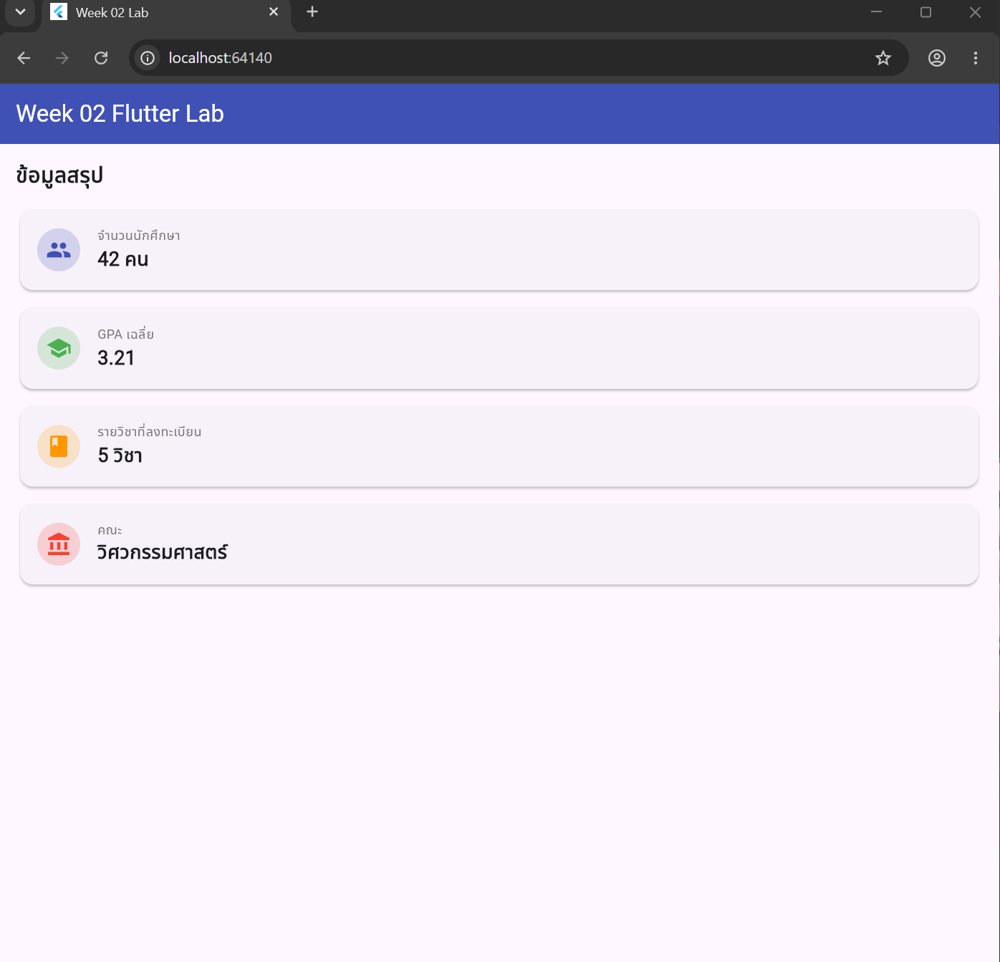
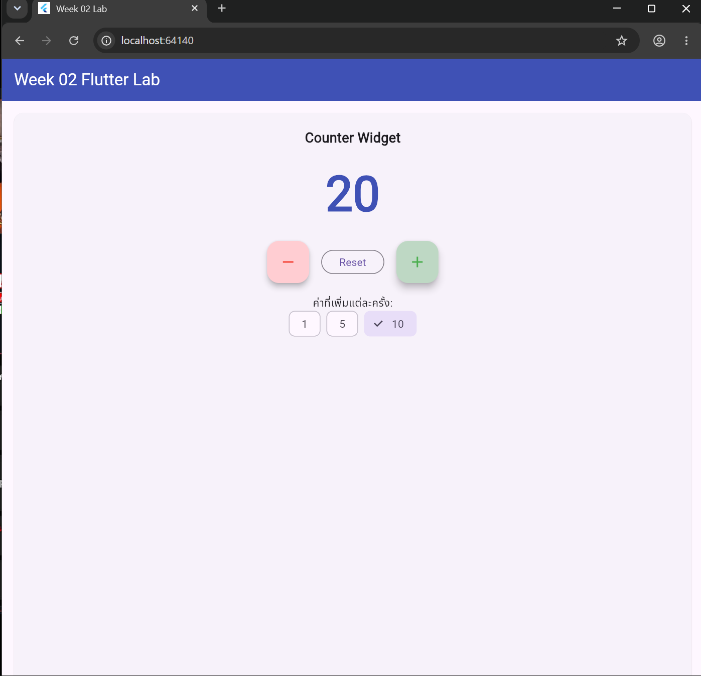
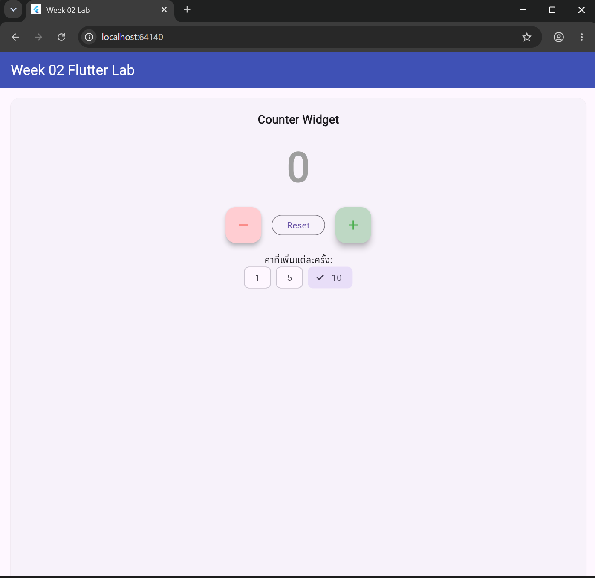
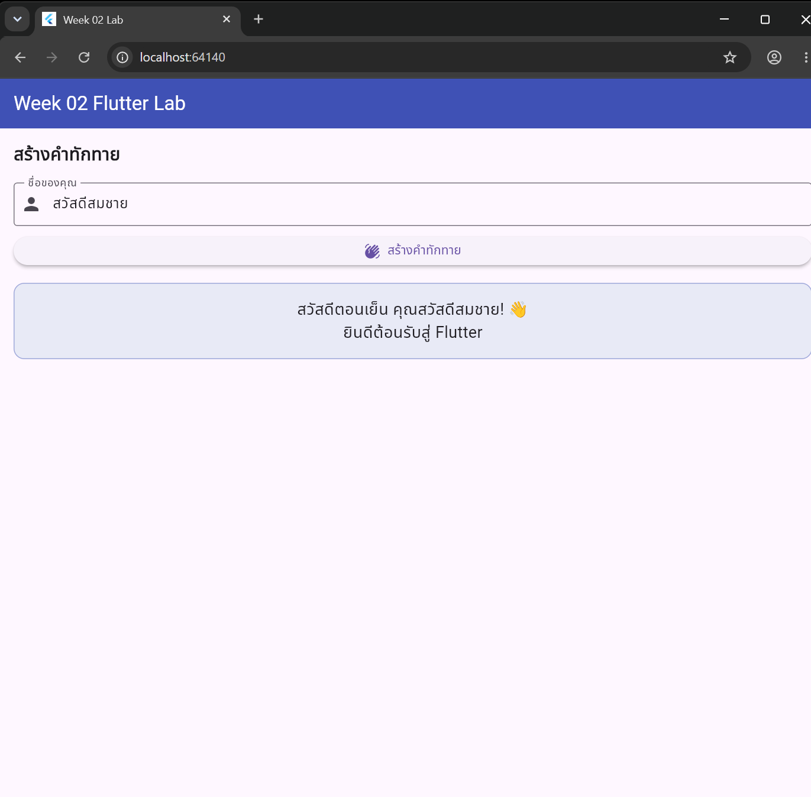
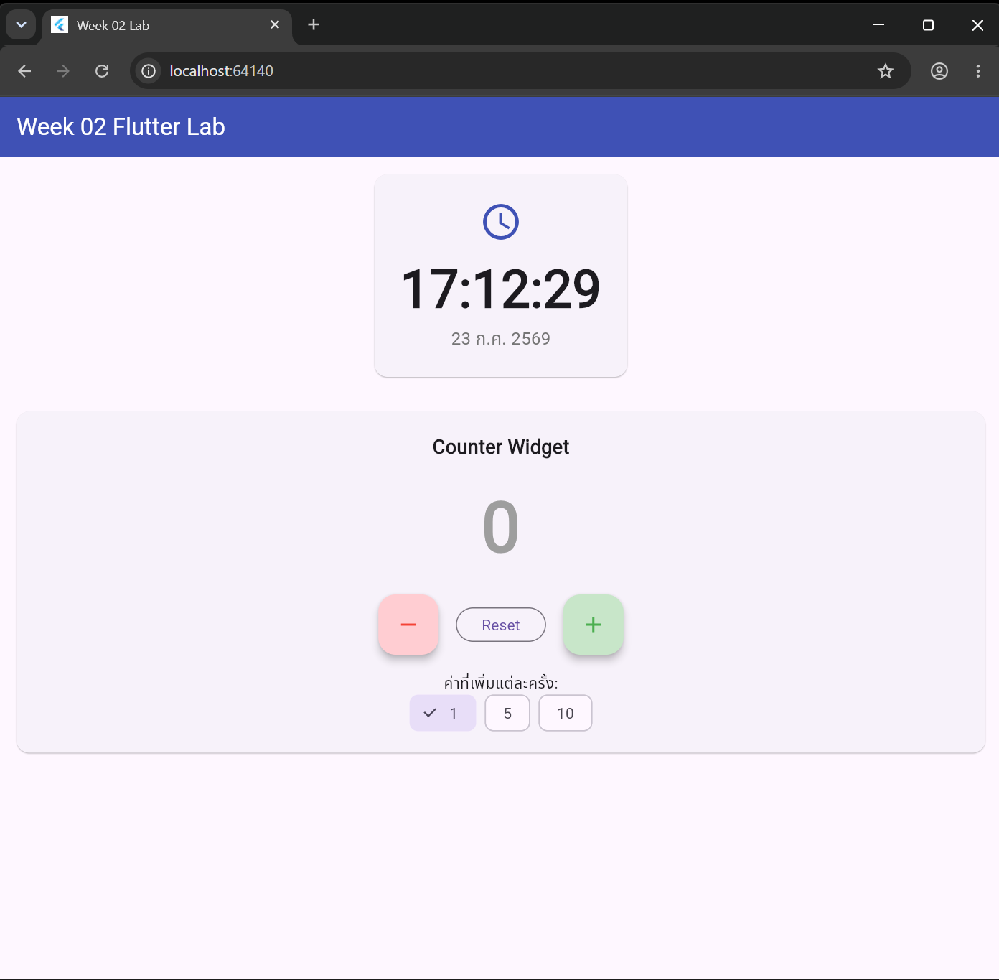
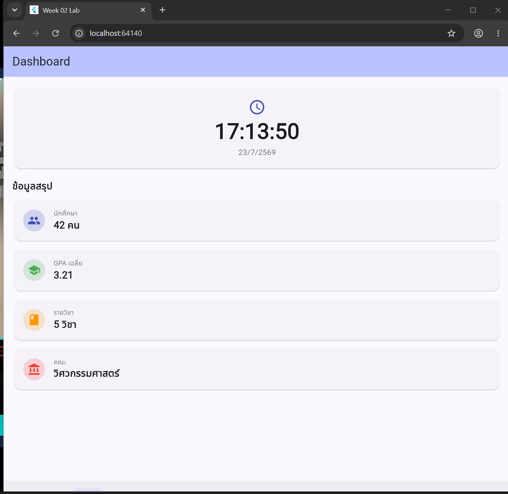

# Week02 Lab 2-2 — Flutter Framework Basics

โปรเจกต์ Flutter สำหรับใบงานการทดลองที่ 2-2 (รายละเอียดใบงานเต็มดูที่ [week02_lab2-2.md](week02_lab2-2.md))

โค้ดของแอปอยู่ที่ [`week02_flutter_lab/lib/main.dart`](week02_flutter_lab/lib/main.dart)

## วิธีรัน

```bash
cd week02_flutter_lab
flutter run -d chrome
```

## ความคืบหน้า

### ✅ การทดลองที่ 1 — Hello World และโครงสร้างพื้นฐาน
เปลี่ยนข้อความเป็น `'สวัสดี Nithi! 🎉'` และ `fontSize` เป็น `48`



### ✅ การทดลองที่ 2 — Layout Widgets: Column, Row, Container
จัด `Container` + `Row` ของกล่อง A/B/C/D ด้วย `Column`, ทดลองเปลี่ยน `mainAxisAlignment`




### ✅ การทดลองที่ 3 — StatelessWidget แรก (InfoCard)
สร้าง `InfoCard` widget รับ title/value/icon/color แล้วใช้ซ้ำ 3 ครั้ง จากนั้นเพิ่มการ์ดที่ 4 "คณะ"




### ✅ การทดลองที่ 4 — StatefulWidget: Counter
สร้าง `CounterSection` ปุ่ม +/−/Reset และเลือก Step (1/5/10), ทดลองลบ `setState()` ออกดูว่า UI ไม่อัปเดต




### ✅ การทดลองที่ 5 — Form และ Text Input
สร้าง `GreetingForm` ใช้ `TextEditingController` รับชื่อแล้วสร้างคำทักทาย พร้อม validation error



### ✅ การทดลองที่ 6 — Lifecycle: initState และ dispose
สร้าง `ClockWidget` ใช้ `Timer.periodic` อัปเดตเวลาทุกวินาที พร้อม `mounted` check และ `dispose()` ยกเลิก Timer



### ✅ การทดลองที่ 7 — รวมทุกส่วนเป็นแอปสมบูรณ์
รวมเป็นแอปเดียวด้วย Bottom Navigation 3 แท็บ (Dashboard / Counter / Form)



### ✅ การทดลองที่ 8 — Hot Reload vs Hot Restart
ทดสอบเปลี่ยนสี Theme (indigo → teal) ระหว่าง Counter ค้างที่ 15: Hot Reload คง state ไว้ (Counter ยังเป็น 15), Hot Restart รีเซ็ต state (Counter กลับเป็น 0) — บันทึกผลไว้ในตารางที่ [week02_lab2-2.md](week02_lab2-2.md#L1441)

### ✅ โจทย์ฝึกทำ (เลือก 2 ข้อ)
- **โจทย์ A** — เพิ่มแท็บที่ 4 "About" แสดงชื่อ/รหัสนักศึกษา/คณะ พร้อม `CircleAvatar` ตัวอักษรแรกของชื่อ
- **โจทย์ D** — เพิ่มแท็บที่ 5 "Todo List" มี `TextField` รับชื่องาน, ปุ่ม Add, ติ๊กถูก/ลบงานได้ และแสดงจำนวนงานที่เหลือ

#### โค้ดส่วน Todo List (โจทย์ D) ทำงานยังไง

ทั้งหมดอยู่ใน `lib/main.dart` ตั้งแต่บรรทัด `// ─── Page 5: Todo List`:

- **`_TodoItem`** (บรรทัด 200) — โมเดลข้อมูล 1 งาน เก็บแค่ `title` (ชื่องาน) กับ `done` (ติ๊กแล้วหรือยัง)
- **`TodoPage`** (บรรทัด 206) — เป็น `StatefulWidget` เพราะรายการงานต้องเปลี่ยนแปลงได้ (เพิ่ม/ติ๊ก/ลบ) ต่างจาก `InfoCard` ที่เป็น `StatelessWidget`
- **`_TodoPageState`** (บรรทัด 213) — ตัว State เก็บ:
  - `_taskController` — `TextEditingController` อ่านค่าจากช่อง `TextField` (แบบเดียวกับ `GreetingForm`)
  - `_todos` — `List<_TodoItem>` ลิสต์งานทั้งหมด นี่คือ "state" หลักของหน้านี้
- **`_addTodo()`** (บรรทัด 223) — อ่านข้อความจาก controller, ถ้าไม่ว่างก็ `setState()` เพิ่มงานใหม่เข้า `_todos` แล้วเคลียร์ช่องกรอก
- **`_toggleTodo(index)`** (บรรทัด 232) — `setState()` สลับค่า `done` ของงานที่ index นั้น (ผูกกับ `onChanged` ของ `CheckboxListTile`)
- **`_deleteTodo(index)`** (บรรทัด 238) — `setState()` เอางานที่ index นั้นออกจากลิสต์ (ผูกกับปุ่มถังขยะ)
- **`remaining`** (บรรทัด 246) — คำนวณจำนวนงานที่ยังไม่ติ๊ก (`_todos.where((t) => !t.done).length`) ใหม่ทุกครั้งที่ `build()` ทำงาน เพื่อโชว์ "งานที่เหลือ: X จาก Y งาน"
- **`ListView.builder`** (ในส่วน `build()`) — วนสร้าง `CheckboxListTile` ให้ทุกงานใน `_todos` แต่ละแถวมี checkbox (ติ๊ก), ข้อความ (ขีดฆ่าถ้า `done`), และปุ่มลบ

หลักการสำคัญ: ทุกจุดที่ข้อมูลเปลี่ยน (เพิ่ม/ติ๊ก/ลบ) ต้องเรียก `setState()` เสมอ ไม่งั้น UI จะไม่รู้ว่าต้อง rebuild — เป็นหลักการเดียวกับ Experiment 4 (Counter)
