# รายงานผลการทดลองการพัฒนาแอปพลิเคชัน Flutter สัปดาห์ที่ 2 67030011 Krittanai B

---

## สรุปผลการทดลองรายหัวข้อ

### การทดลองที่ 1 Hello World และโครงสร้างพื้นฐาน

การทดสอบแก้ไขข้อความและปรับขนาดตัวอักษรเพื่อเรียนรู้ระบบการแสดงผลและโครงสร้างพื้นฐานเริ่มต้นของแอปพลิเคชัน
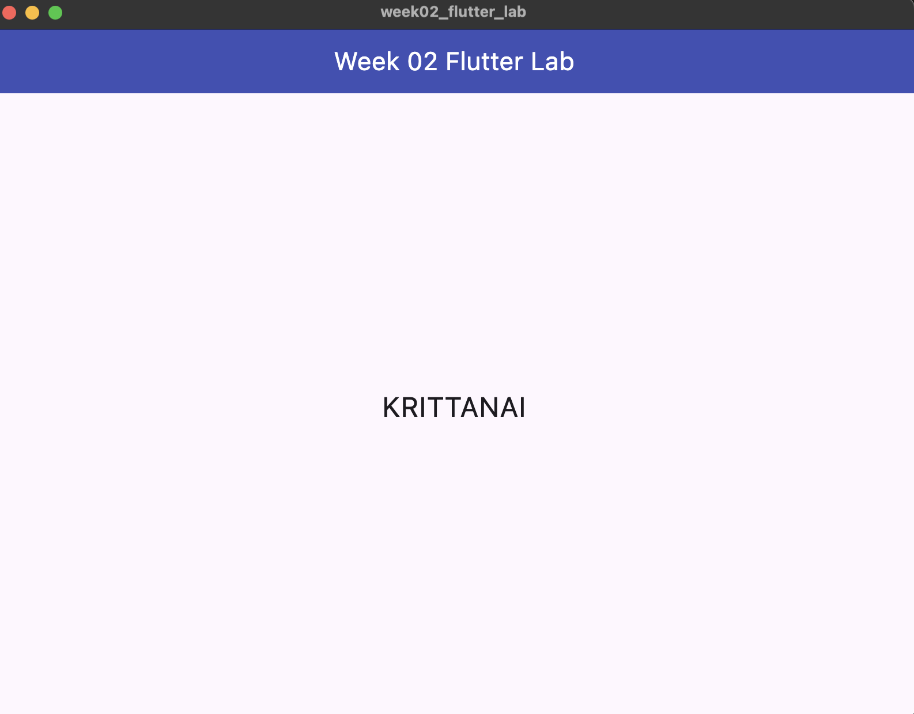
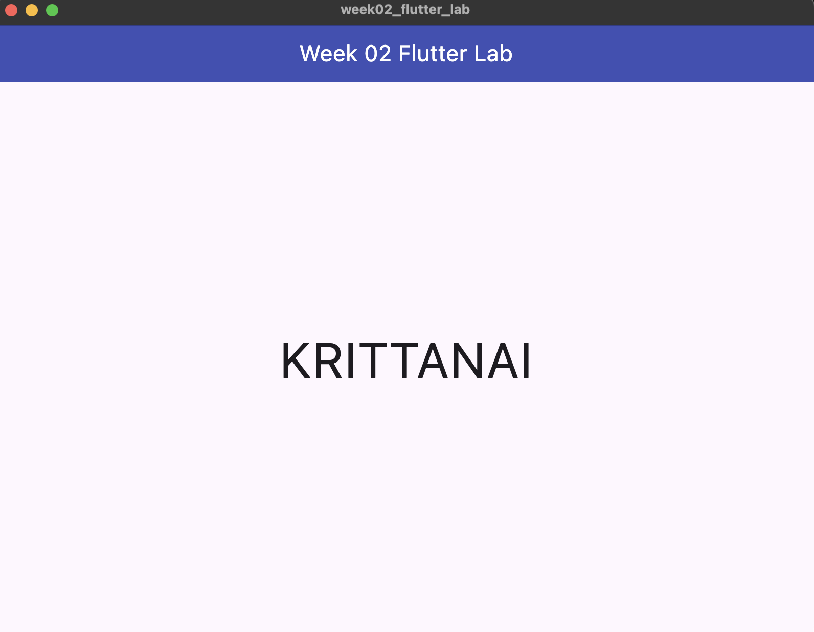

### การทดลองที่ 2 Layout Widgets

การจัดกลุ่มองค์ประกอบแนวตั้งและแนวนอนด้วย Column Row และ Container

- ผลการจัดเรียงรูปแบบต่างๆ ของ MainAxisAlignment
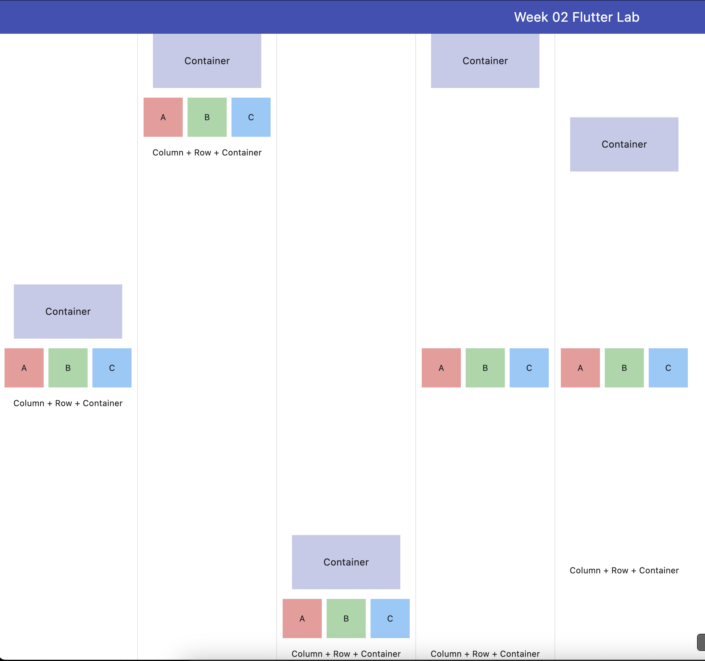
- ผลการเพิ่มส่วนประกอบ D ขนาดแปดสิบสีม่วงต่อท้ายในแถว
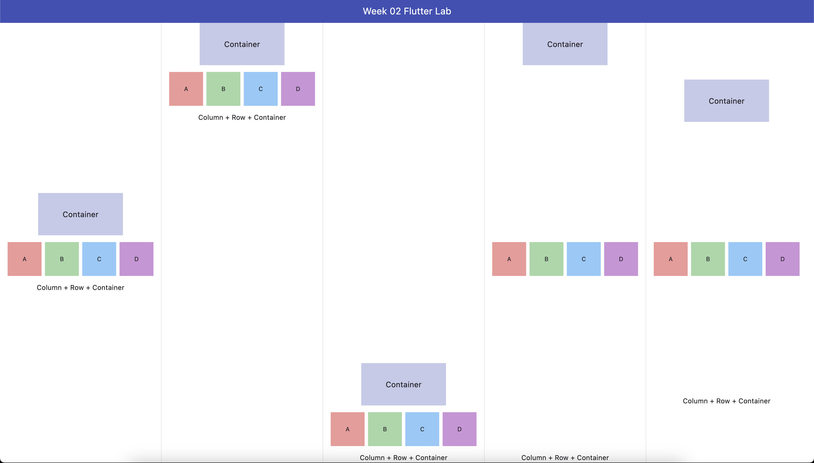

### การทดลองที่ 3 StatelessWidget แรก

การสร้างชิ้นส่วนหน้าจอแบบนำกลับมาใช้ใหม่ได้ด้วยการส่งผ่านตัวแปร

- ผลการแสดงกล่องข้อมูลสรุปจำนวนสามชิ้น
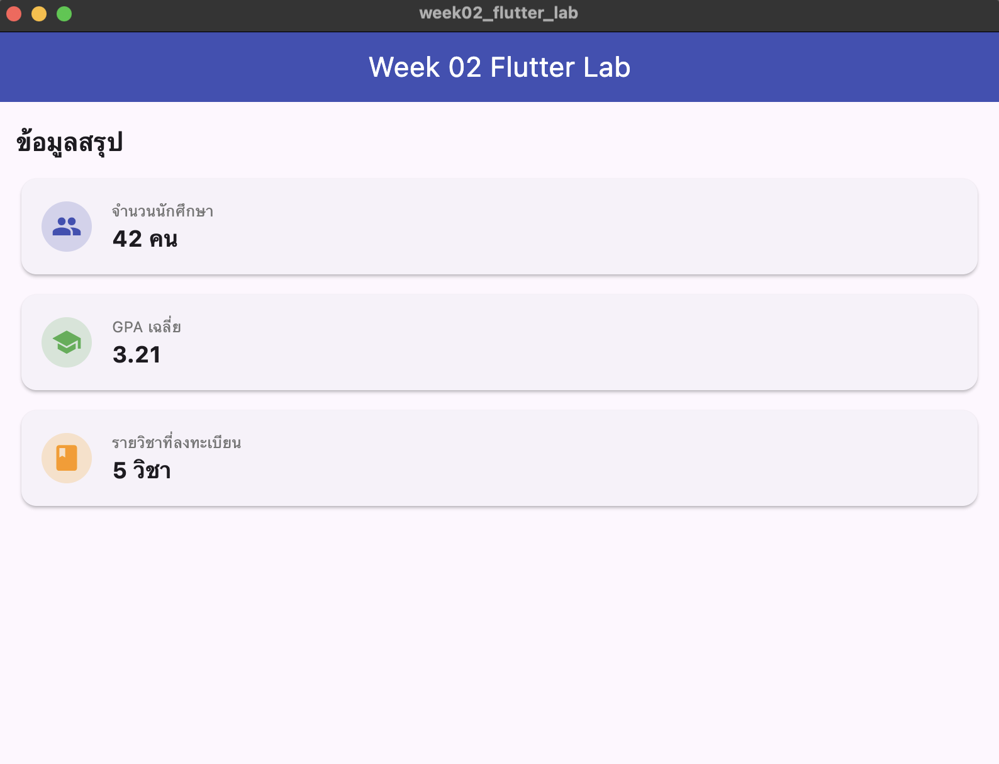
- ผลการเพิ่มกล่องสถิติแสดงคณะสีแดงเป็นกล่องที่สี่
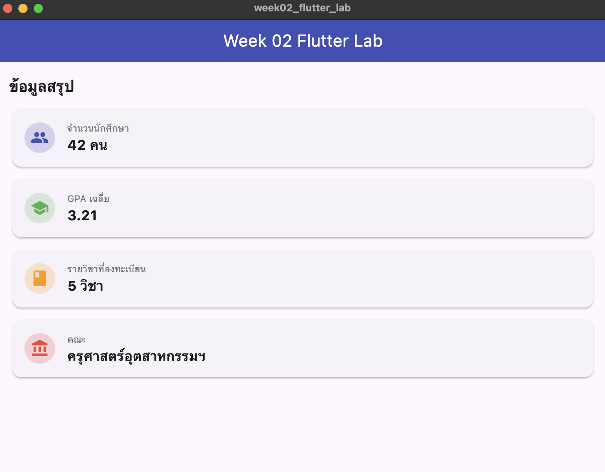

### การทดลองที่ 4 StatefulWidget

การเขียนระบบการเพิ่มลดตัวเลขที่แสดงผลบนหน้าจอโดยใช้ชุดตัวแปรควบคุม

- การสาธิตการทำงานปรับค่าและรีเซ็ตเลขตัวนับ
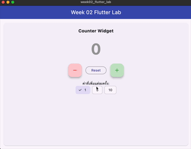
- การทดลองเอาคำสั่ง setState ออกเพื่อสังเกตข้อแตกต่างของการอัปเดตหน้าจอ
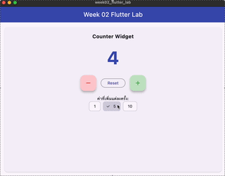

### การทดลองที่ 5 Form และ Text Input

การดึงค่าตัวหนังสือจากกล่องรับข้อความเพื่อประมวลผลคำทักทาย

- การสาธิตการทำงานกรอกชื่อพร้อมแสดงผลตามวันเวลา
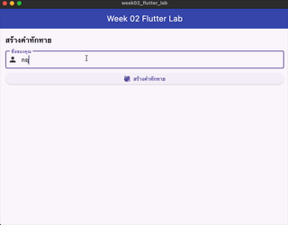
- การทดสอบเมื่อไม่ได้ระบุชื่อและกดปุ่มเคลียร์ข้อมูล
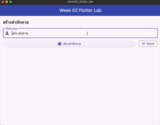

### การทดลองที่ 6 Lifecycle

การควบคุมเวลาและวันที่ให้เดินไปแบบอัตโนมัติวินาทีต่อวินาทีพร้อมการปิดตัวจับเวลาเพื่อป้องกันปัญหาหน่วยความจำรั่วไหล
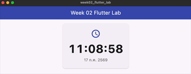

### การทดลองที่ 7 แอปพลิเคชันสมบูรณ์

การนำทุกการทดลองมารวมไว้ในแอปเดียวสลับหน้าจอด้วยเมนูด้านล่างสุด
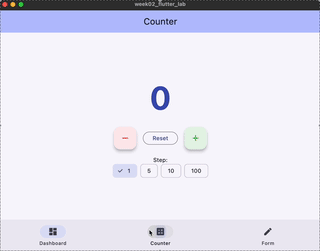

---

## โจทย์ฝึกทำและขยายแอปพลิเคชันเพิ่มเติม

### โจทย์ C ระดับกลาง เพิ่มตัวเลือกการสลับภาษาทักทาย

การออกแบบปุ่มกดแบบ Dropdown เพื่อสลับภาษาคำทักทายประกอบด้วยไทย อังกฤษ และญี่ปุ่น
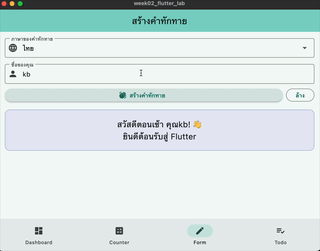

### โจทย์ D ระดับยาก ระบบรายการสิ่งที่ต้องทำ Todo List

การสร้างช่องพิมพ์ข้อความปุ่มเพิ่มงานรายการขีดฆ่างานที่ทำเสร็จและการนับจำนวนงานคงเหลือ
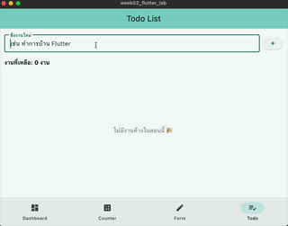

---

## คำตอบคำถามท้ายใบงาน

### ข้อ 1 การวาดด้วย Engine ตนเองของ Flutter

เพื่อความสม่ำเสมอของหน้าตาแอปทุกแพลตฟอร์มและการวาดด้วยเฟรมเรตสูง โดยมีข้อดีคือควบคุมพิกเซลได้เหมือนกันทุก OS และประมวลผลเร็ว ส่วนข้อเสียคือทำให้ขนาดแอปใหญ่ขึ้นและดีไซน์ไม่เปลี่ยนแปลงตามระบบปฏิบัติการดั้งเดิม

### ข้อ 2 ความสัมพันธ์ของ Widget Element และ RenderObject

Widget Tree ทำหน้าที่แสดงโครงสร้างการจัดวางหน้าตาแอป Element Tree ทำหน้าที่เป็นตัวกลางเชื่อมโยงและจดจำตำแหน่งในโครงสร้าง และ RenderObject Tree ทำหน้าที่คำนวณขนาดและวาดกราฟิกจริงบนหน้าจอ ซึ่งเหตุผลที่มีทั้งสามส่วนเพื่อช่วยแยกการเปลี่ยนแปลงเฉพาะจุด ทำให้ไม่ต้องคำนวณและวาดใหม่ทั้งหมดทุกครั้ง ส่งผลให้ประสิทธิภาพสูงมาก

### ข้อ 3 การตัดคำสั่งอัปเดตหน้าจอในการทดลองที่ 4

ผลลัพธ์คือตัวเลขบนหน้าจอไม่ยอมเปลี่ยนแปลงตามการกดปุ่ม เนื่องจากตัวแปรในหน่วยความจำเพิ่มขึ้นจริงแต่การลบคำสั่งแจ้งเตือนออกส่งผลให้เฟรมเวิร์กไม่รับรู้และไม่มีการสร้างหน้าจอใหม่เพื่ออัปเดตผลลัพธ์บนหน้าจอดังกล่าว

### ข้อ 4 การเลือกใช้วิดเจ็ต Stateless และ Stateful

ตัดสินใจจากความจำเป็นในการเปลี่ยนแปลงโครงสร้างหน้าตาเมื่อข้อมูลเปลี่ยนแปลงหรือผู้ใช้สั่งงาน โดยให้ใช้แบบ Stateless แสดงข้อมูลที่คงที่อย่าง InfoCard หรือหน้า DashboardPage และใช้แบบ Stateful จัดการข้อมูลที่ปรับเปลี่ยนได้ตลอดเวลาอย่าง CounterSection หรือ GreetingForm

### ข้อ 5 ความสำคัญของการปิดคืนหน่วยความจำและตัวจับเวลา

เพื่อยกเลิกการทำงานของตัวจับเวลาในขณะที่หน้านั้นปิดตัวลง หากไม่เรียกใช้งานคำสั่งยกเลิกนี้จะทำให้ตัวจับเวลายังคงประมวลผลข้อมูลและทำงานในพื้นหลังต่อไปเรื่อย ๆ ซึ่งเป็นจุดเริ่มต้นของปัญหาหน่วยความจำรั่วไหลและทำให้ประสิทธิภาพการทำงานลดลงในระยะยาว
