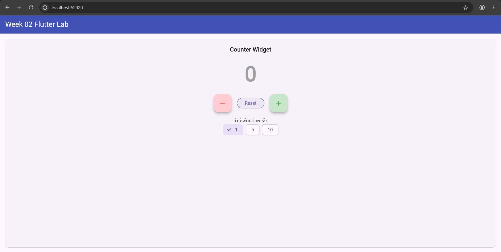
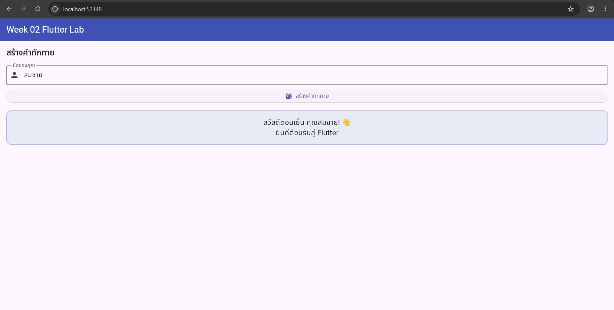
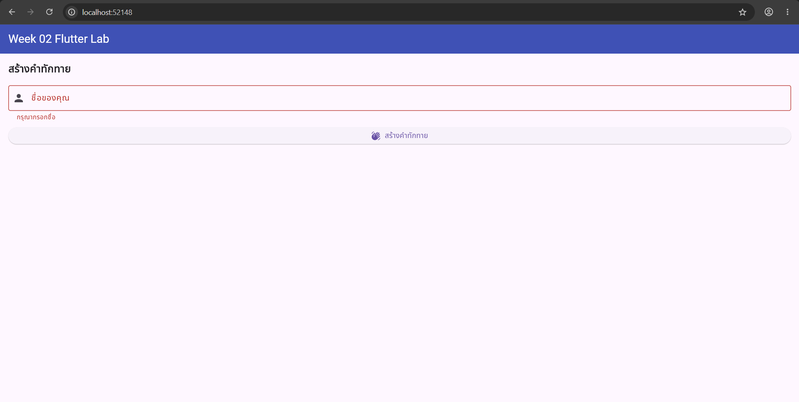
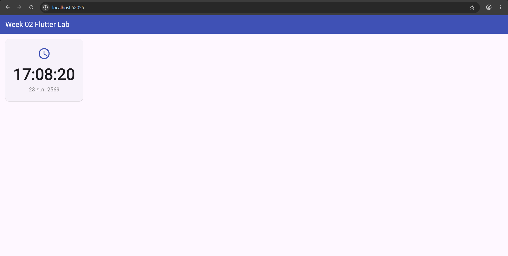
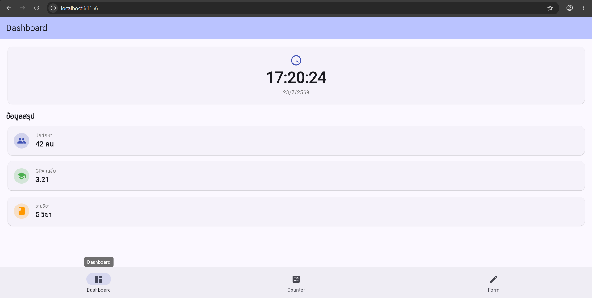
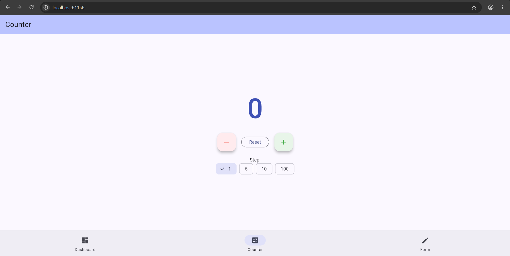
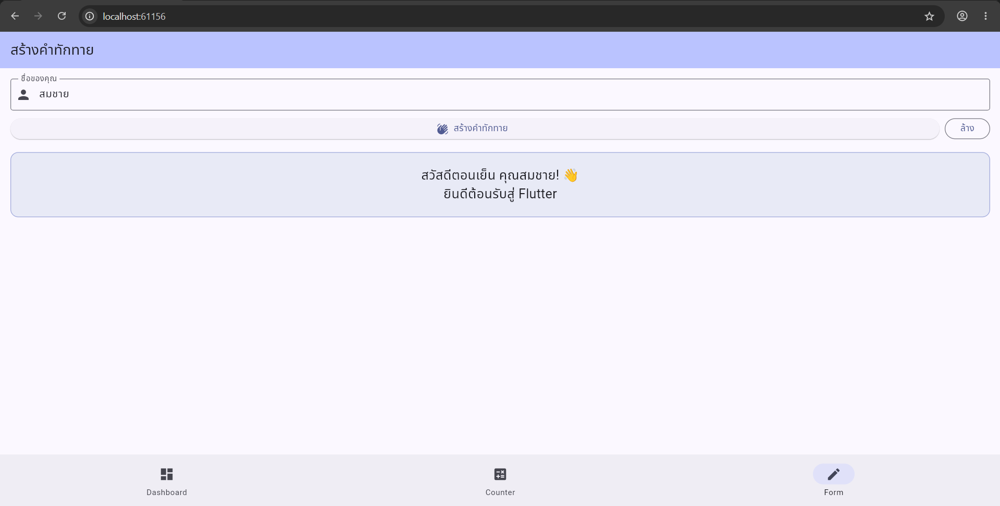
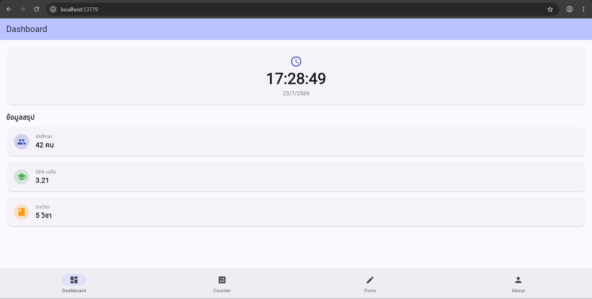
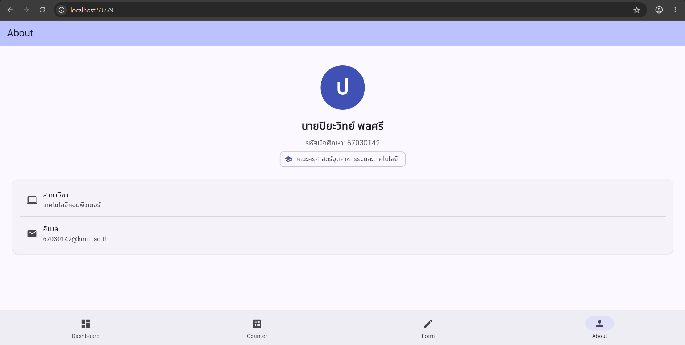

# ใบงานการทดลองที่ 2-2
# Flutter Framework Basics
### วิชา: การพัฒนาซอฟต์แวร์สำหรับอุปกรณ์เคลื่อนที่

| | |
|--|--|
| **สัปดาห์ที่** | 2 |
| **ใบงานที่** | 2-2 จาก 2 |
| **เวลา** | 2 ชั่วโมง 30 นาที |
| **เครื่องมือ** | VS Code + Flutter SDK (ติดตั้งแล้วจากสัปดาห์ที่ 1) |

---

## วัตถุประสงค์

เมื่อสิ้นสุดการทดลอง นักศึกษาสามารถ:

1. อธิบายโครงสร้าง Widget Tree และความสัมพันธ์ระหว่าง Parent-Child Widget ได้
2. เขียน StatelessWidget ที่รับ Parameter และแสดงผลได้
3. เขียน StatefulWidget ที่ใช้ setState() อัปเดต UI ได้
4. อธิบาย Widget Lifecycle และรู้ว่าควรทำอะไรใน initState() และ dispose()
5. ใช้ Hot Reload และ Hot Restart ได้อย่างถูกต้อง

---

## การเตรียมตัวก่อนทดลอง

### ตรวจสอบการติดตั้ง Flutter

เปิด Terminal แล้วรันคำสั่งต่อไปนี้:

```bash
flutter doctor
```

**ผลที่ต้องการเห็น (อย่างน้อย):**
```
[✓] Flutter (Channel stable, 3.x.x, ...)
[✓] Android toolchain
[✓] VS Code (version ...)
[!] Android Studio  ← ไม่ต้องสนใจ ไม่ใช้ใน Lab นี้
```

ถ้าเห็น `[✗] Flutter` แสดงว่ายังไม่ได้ติดตั้ง ให้ทำตาม **ภาคผนวก A** ก่อน

### ตรวจสอบ VS Code Extensions

เปิด VS Code → Extensions (Ctrl+Shift+X) → ค้นหาและติดตั้ง:
- **Flutter** (by Dart Code) — ต้องมี
- **Dart** (by Dart Code) — ต้องมี

---

## ทฤษฎีก่อนการทดลอง

### ก. Flutter Architecture — ทำงานอย่างไรเบื้องหลัง

Flutter แตกต่างจาก Framework อื่นตรงที่ **ไม่ได้ใช้ Native UI Component** แต่วาด UI ทุก Pixel ด้วย Rendering Engine ของตัวเอง

```
┌─────────────────────────────────────────────────────────┐
│                  Flutter Application                    │
│              (โค้ด Dart ที่เราเขียน)                        │
├─────────────────────────────────────────────────────────┤
│               Flutter Framework (Dart)                  │
│   Widgets │ Animation │ Painting │ Gestures │ Services  │
├─────────────────────────────────────────────────────────┤
│        Flutter Engine (C++ / Impeller)                  │
│   วาด UI ทุก Pixel ลงบน Canvas โดยตรง                    │
│   ← ไม่พึ่ง Native Button, Native Text ของ Platform        │
├────────────────────┬────────────────────────────────────┤
│   Android Embedder │   iOS Embedder                     │
│   (รับ Surface)    │   (รับ Surface)                      │
├────────────────────┴────────────────────────────────────┤
│              Operating System                           │
└─────────────────────────────────────────────────────────┘
```

**ผลที่ได้จาก Architecture นี้:**
- UI เหมือนกันทุก Pixel บนทุก Platform
- ไม่มี Bridge ระหว่าง Dart กับ Native — Performance ดี
- Flutter รองรับ Android, iOS, Web, Desktop จาก Codebase เดียว

---

### ข. Widget Tree — โครงสร้างต้นไม้ของ UI

ทุกอย่างใน Flutter เป็น Widget และซ้อนกันเป็นต้นไม้

```
MaterialApp  ← Root ของทั้งแอป
└── Scaffold  ← โครงหน้าจอหลัก
    ├── AppBar  ← แถบด้านบน
    │   └── Text("ชื่อหน้า")
    └── body: Column  ← จัดเรียงแนวตั้ง
        ├── Image.network(...)  ← รูปภาพ
        ├── Text("ชื่อ")
        ├── SizedBox(height: 16)  ← ช่องว่าง
        └── ElevatedButton(...)  ← ปุ่ม
```

**กฎการไหลของข้อมูล:**

```
Parent Widget
│  data = "ข้อมูล"
│  ↓ ส่งผ่าน Constructor (Props)
│
Child Widget(text: data)
│  ↓ แสดงผล
│
GrandChild Widget(...)
```

- **ข้อมูลไหลลง** จาก Parent → Child เสมอ
- **Event ไหลขึ้น** ผ่าน Callback Function

---

### ค. สามต้นไม้ที่ Flutter ใช้จัดการ UI

```
Widget Tree          Element Tree         RenderObject Tree
(คำอธิบาย UI)        (Instance จริง)      (วาดบนหน้าจอ)

Text("สวัสดี")  →    TextElement    →    RenderParagraph
    │                    │                     │
    │            จำตำแหน่งและ State     วาด Pixel จริง
    │
    └─ Widget เป็น Immutable ─┐
       สร้างใหม่ได้บ่อย        │
       ราคาถูก               Element ไม่สร้างใหม่
                             แค่อัปเดต → RenderObject
```

**สิ่งสำคัญ:** Widget เป็น Immutable (เปลี่ยนค่าตรงๆ ไม่ได้) เมื่อต้องการเปลี่ยน UI ต้อง rebuild Widget ใหม่ผ่าน setState()

---

### ง. StatelessWidget vs StatefulWidget

```
                ถาม: "Widget นี้ต้องเปลี่ยนแปลงเองได้ไหม?"
                              │
                  ┌───────────┴────────────┐
                 ไม่                      ใช่
                  │                        │
                  ▼                        ▼
          StatelessWidget          StatefulWidget
          (UI คงที่)               (UI เปลี่ยนได้)

ตัวอย่าง:                       ตัวอย่าง:
- Card แสดงข้อมูล              - Counter ที่นับเลข
- Avatar โปรไฟล์               - Form ที่กรอกข้อมูล
- Badge แสดงสถานะ             - Tab ที่สลับได้
- ข้อความทั่วไป                - Loading → Data → Error
```

**StatelessWidget — โครงสร้าง:**

```dart
class MyCard extends StatelessWidget {
  // รับข้อมูลจากภายนอกผ่าน Constructor เท่านั้น
  final String title;
  final String subtitle;

  const MyCard({              // const constructor = Performance ดีขึ้น
    super.key,
    required this.title,
    required this.subtitle,
  });

  @override
  Widget build(BuildContext context) {
    // build() เรียกเมื่อ Parent rebuild
    // ไม่มี State ที่เปลี่ยนเองได้
    return Card(
      child: ListTile(
        title: Text(title),
        subtitle: Text(subtitle),
      ),
    );
  }
}
```

**StatefulWidget — โครงสร้างสองชั้น:**

```dart
// ชั้นที่ 1: Widget (Immutable เหมือน Stateless)
class CounterWidget extends StatefulWidget {
  final String label;
  const CounterWidget({super.key, required this.label});

  @override
  State<CounterWidget> createState() => _CounterWidgetState();
}

// ชั้นที่ 2: State (เปลี่ยนได้ คงอยู่แม้ Widget rebuild)
class _CounterWidgetState extends State<CounterWidget> {
  int _count = 0;  // State ที่เปลี่ยนได้

  // เข้าถึง Widget's properties ผ่าน widget.xxx
  String get _label => widget.label;

  void _increment() {
    setState(() {     // บอก Flutter: "State เปลี่ยน ให้ rebuild"
      _count++;       // แก้ State ข้างใน setState()
    });
  }

  @override
  Widget build(BuildContext context) {
    return Column(
      children: [
        Text("$_label: $_count"),
        ElevatedButton(
          onPressed: _increment,
          child: const Text("+1"),
        ),
      ],
    );
  }
}
```

---

### จ. Widget Lifecycle ของ StatefulWidget

```
สร้าง StatefulWidget
        │
        ▼
  createState()   ← Flutter สร้าง State Object
        │
        ▼
  initState()     ← ✅ รันครั้งเดียวเมื่อสร้าง Widget
        │            ✅ โหลดข้อมูลเริ่มต้น
        │            ✅ สมัคร Stream / Timer
        │            ✅ ตั้ง AnimationController
        │            ❗ ต้องเรียก super.initState() ก่อนเสมอ
        ▼
  build()         ← วาด UI ทุกครั้งที่ setState() เรียก
        │
    setState() → build() อีกครั้ง (วนซ้ำ)
        │
        ▼
  didUpdateWidget()  ← เมื่อ Parent ส่ง Parameter ใหม่
        │
        ▼
  deactivate()    ← Widget ถูกนำออกจาก Tree ชั่วคราว
        │
        ▼
  dispose()       ← ✅ รันครั้งเดียวเมื่อ Widget ถูกลบ
                     ✅ ยกเลิก Timer, Stream Subscription
                     ✅ dispose AnimationController
                     ✅ dispose TextEditingController
                     ❗ ต้องเรียก super.dispose() หลังสุดเสมอ
```

**ข้อควรระวัง: mounted check**

```dart
Future<void> _loadData() async {
  var result = await someApiCall();

  // ❗ ต้องตรวจสอบ mounted ก่อน setState
  // เพราะ Widget อาจถูก dispose() ระหว่างรอ API
  if (mounted) {
    setState(() {
      _data = result;
    });
  }
}
```

---

### ฉ. Hot Reload vs Hot Restart

```
ทำอะไร?      Hot Reload ⚡              Hot Restart 🔄
             Inject โค้ดใหม่ →          รีสตาร์ทแอป
             rebuild Widget Tree        ตั้งต้นใหม่

เวลา:         < 1 วินาที                2-5 วินาที
State:        ✅ คงอยู่                  ❌ รีเซ็ต

เหมาะกับ:    แก้สี, ขนาด, Text         แก้ initState()
             Logic ใน build()           แก้ main()
             เพิ่ม/ลบ Widget           เพิ่ม Asset ใหม่

วิธีใช้:     บันทึกไฟล์ (Ctrl+S)       กด 🔄 ใน toolbar
             หรือกด ⚡ ใน toolbar      หรือพิมพ์ R ใน Terminal
```

---

## การทดลอง — สร้าง Flutter App ทีละขั้นตอน

> **แนวทาง:** ใบงานนี้ค่อยๆ สร้างแอปทีละชิ้นส่วน เพื่อให้เห็นว่าแต่ละ Widget ทำหน้าที่อะไร ก่อนรวมกันเป็นแอปสมบูรณ์

### ขั้นตอนการเตรียม Project

**ขั้นตอนที่ 1** เปิด Terminal แล้วรันคำสั่งสร้าง Project ใหม่:

```bash
cd ~/Documents
flutter create week02_flutter_lab
cd week02_flutter_lab
code .
```

**ขั้นตอนที่ 2** VS Code เปิดขึ้นมา รอสักครู่จนเห็น `pub get` ทำงานเสร็จ (มุมล่างขวา)

**ขั้นตอนที่ 3** เปิด Emulator

วิธีที่ 1 — ผ่าน VS Code:
- กด `Ctrl+Shift+P` → พิมพ์ `Flutter: Launch Emulator`
- เลือก Emulator ที่ต้องการ

วิธีที่ 2 — ผ่าน Terminal:
```bash
flutter emulators --launch <emulator_id>
# หรือดู emulator ที่มีก่อน
flutter emulators
```

> **ไม่มี Emulator?** ดู **ภาคผนวก B** เพื่อสร้าง Android Emulator

**ขั้นตอนที่ 4** ตรวจสอบว่า Emulator ขึ้นที่มุมขวาล่างของ VS Code เช่น `sdk gphone... (android)`

---

### การทดลองที่ 1 — Hello World และโครงสร้างพื้นฐาน

**เป้าหมาย:** เข้าใจโครงสร้างขั้นต่ำของ Flutter App

**ขั้นตอนที่ 1** เปิดไฟล์ `lib/main.dart` แล้ว **แทนที่เนื้อหาทั้งหมด** ด้วยโค้ดนี้:

```dart
import 'package:flutter/material.dart';

// จุดเริ่มต้นของ App ทุกตัว
void main() {
  runApp(const MyApp());
}

// Root Widget ของแอป
class MyApp extends StatelessWidget {
  const MyApp({super.key});

  @override
  Widget build(BuildContext context) {
    return MaterialApp(
      title: 'Week 02 Lab',
      // ปิด Banner "DEBUG" ที่มุมขวาบน
      debugShowCheckedModeBanner: false,
      home: const HomePage(),
    );
  }
}

// หน้าแรก
class HomePage extends StatelessWidget {
  const HomePage({super.key});

  @override
  Widget build(BuildContext context) {
    return Scaffold(
      appBar: AppBar(
        title: const Text('Week 02 Flutter Lab'),
        backgroundColor: Colors.indigo,
        foregroundColor: Colors.white,
      ),
      body: const Center(
        child: Text(
          'สวัสดี Flutter! 🎉',
          style: TextStyle(fontSize: 24),
        ),
      ),
    );
  }
}
```

**ขั้นตอนที่ 2** รันแอปด้วยคำสั่ง:

```bash
flutter run
```

หรือกด **F5** ใน VS Code (เลือก Flutter ถ้าถาม)

**ขั้นตอนที่ 3** รอจน App ขึ้นบน Emulator ควรเห็นข้อความ "สวัสดี Flutter!"

**✏️ ทดลองแก้ไข A:** แก้ข้อความ `'สวัสดี Flutter! 🎉'` เป็นชื่อของตัวเอง แล้วบันทึกไฟล์ (`Ctrl+S`) สังเกตว่า UI อัปเดตทันทีผ่าน **Hot Reload** โดยไม่ต้อง Restart แอป

**✏️ ทดลองแก้ไข B:** เปลี่ยน `fontSize: 24` เป็น `fontSize: 48` บันทึกไฟล์และสังเกตผล

**บันทึกรูปผลการทดลอง**


---

### การทดลองที่ 2 — Layout Widgets: Column, Row, Container

**เป้าหมาย:** จัดวาง Widget ด้วย Column, Row และ Container ได้

**ขั้นตอนที่ 1** แทนที่ `body` ของ `HomePage` ด้วยโค้ดนี้:

```dart
      body: Column(
        // mainAxisAlignment จัดวางตามแกนหลัก (แนวตั้งสำหรับ Column)
        mainAxisAlignment: MainAxisAlignment.center,
        // crossAxisAlignment จัดวางตามแกนรอง (แนวนอนสำหรับ Column)
        crossAxisAlignment: CrossAxisAlignment.center,
        children: [
          // Container — กล่องที่ปรับแต่งได้
          Container(
            width: 200,
            height: 100,
            color: Colors.indigo.shade100,
            child: const Center(
              child: Text(
                'Container',
                style: TextStyle(fontSize: 18),
              ),
            ),
          ),

          // SizedBox — ช่องว่างระหว่าง Widget
          const SizedBox(height: 16),

          // Row — จัดเรียงแนวนอน
          Row(
            mainAxisAlignment: MainAxisAlignment.center,
            children: [
              Container(width: 80, height: 80, color: Colors.red.shade200,
                  child: const Center(child: Text('A'))),
              const SizedBox(width: 8),
              Container(width: 80, height: 80, color: Colors.green.shade200,
                  child: const Center(child: Text('B'))),
              const SizedBox(width: 8),
              Container(width: 80, height: 80, color: Colors.blue.shade200,
                  child: const Center(child: Text('C'))),
            ],
          ),

          const SizedBox(height: 16),
          const Text('Column + Row + Container', style: TextStyle(fontSize: 16)),
        ],
      ),
```

**ขั้นตอนที่ 2** บันทึกและสังเกตผล

**✏️ ทดลองแก้ไข C:** เปลี่ยน `MainAxisAlignment.center` ของ Column เป็น `.start`, `.end`, `.spaceBetween`, `.spaceEvenly` ทีละอัน สังเกตการเปลี่ยนแปลง

**บันทึกรูปผลการทดลอง**


**✏️ ทดลองแก้ไข D:** ใน Row เพิ่ม Container D สีม่วง ขนาด 80×80 ต่อจาก C
**บันทึกรูปผลการทดลอง**


---

### การทดลองที่ 3 — StatelessWidget แรก

**เป้าหมาย:** สร้าง Reusable Widget ที่รับ Parameter ได้

**ขั้นตอนที่ 1** เพิ่ม Class `InfoCard` **ด้านล่าง** Class `HomePage` (ยังอยู่ในไฟล์เดิม):

```dart
// StatelessWidget ที่รับ Parameter
class InfoCard extends StatelessWidget {
  final String title;
  final String value;
  final IconData icon;
  final Color color;

  const InfoCard({
    super.key,
    required this.title,
    required this.value,
    required this.icon,
    this.color = Colors.indigo,  // มีค่า default
  });

  @override
  Widget build(BuildContext context) {
    return Card(
      elevation: 2,
      child: Padding(
        padding: const EdgeInsets.all(16),
        child: Row(
          children: [
            // ไอคอนในวงกลมสี
            CircleAvatar(
              backgroundColor: color.withOpacity(0.2),
              child: Icon(icon, color: color),
            ),
            const SizedBox(width: 16),
            // ข้อมูล
            Column(
              crossAxisAlignment: CrossAxisAlignment.start,
              children: [
                Text(
                  title,
                  style: TextStyle(
                    fontSize: 12,
                    color: Colors.grey.shade600,
                  ),
                ),
                Text(
                  value,
                  style: const TextStyle(
                    fontSize: 18,
                    fontWeight: FontWeight.bold,
                  ),
                ),
              ],
            ),
          ],
        ),
      ),
    );
  }
}
```

**ขั้นตอนที่ 2** แก้ `body` ของ `HomePage` เพื่อใช้ `InfoCard`:

```dart
      body: Padding(
        padding: const EdgeInsets.all(16),
        child: Column(
          crossAxisAlignment: CrossAxisAlignment.start,
          children: [
            const Text(
              'ข้อมูลสรุป',
              style: TextStyle(fontSize: 20, fontWeight: FontWeight.bold),
            ),
            const SizedBox(height: 12),

            // ใช้ InfoCard ซ้ำได้หลายครั้งด้วย Parameter ต่างกัน
            const InfoCard(
              title: 'จำนวนนักศึกษา',
              value: '42 คน',
              icon: Icons.people,
              color: Colors.indigo,
            ),

            const SizedBox(height: 8),

            const InfoCard(
              title: 'GPA เฉลี่ย',
              value: '3.21',
              icon: Icons.school,
              color: Colors.green,
            ),

            const SizedBox(height: 8),

            InfoCard(
              title: 'รายวิชาที่ลงทะเบียน',
              value: '5 วิชา',
              icon: Icons.book,
              color: Colors.orange,
            ),
          ],
        ),
      ),
```

**ขั้นตอนที่ 3** บันทึกและตรวจสอบผล — ควรเห็น Card 3 ใบเรียงกัน
**บันทึกรูปผลการทดลอง**


**✏️ ทดลองแก้ไข E:** เพิ่ม `InfoCard` ที่ 4 แสดง "คณะ" ด้วยไอคอน `Icons.account_balance` สีแดง

**บันทึกรูปผลการทดลอง**

---

### การทดลองที่ 4 — StatefulWidget: Counter

**เป้าหมาย:** อธิบายการทำงานของ setState() จากตัวอย่างที่เรียบง่ายที่สุดได้

**ขั้นตอนที่ 1** เพิ่ม Class `CounterSection` ด้านล่างไฟล์:

```dart
class CounterSection extends StatefulWidget {
  const CounterSection({super.key});

  @override
  State<CounterSection> createState() => _CounterSectionState();
}

class _CounterSectionState extends State<CounterSection> {
  // === State ===
  int _count = 0;       // ตัวเลข Counter
  int _step = 1;        // ค่าที่เพิ่มแต่ละครั้ง

  // === Methods ===
  void _increment() {
    setState(() {
      _count += _step;
      // ลอง: แก้เป็น _count++ แล้วดูว่าต่างกันไหม
    });
  }

  void _decrement() {
    setState(() {
      if (_count - _step < 0) {
        _count = 0; // ไม่ให้ต่ำกว่า 0
      } else {
        _count -= _step;
      }
    });
  }

  void _reset() {
    setState(() {
      _count = 0;
    });
  }

  void _changeStep(int newStep) {
    setState(() {
      _step = newStep;
    });
  }

  @override
  Widget build(BuildContext context) {
    return Card(
      margin: const EdgeInsets.all(16),
      child: Padding(
        padding: const EdgeInsets.all(20),
        child: Column(
          children: [
            const Text(
              'Counter Widget',
              style: TextStyle(fontSize: 18, fontWeight: FontWeight.bold),
            ),
            const SizedBox(height: 16),

            // แสดงตัวเลข
            Text(
              '$_count',
              style: TextStyle(
                fontSize: 64,
                fontWeight: FontWeight.bold,
                color: _count > 0
                    ? Colors.indigo
                    : _count < 0
                        ? Colors.red
                        : Colors.grey,
              ),
            ),

            const SizedBox(height: 16),

            // ปุ่มควบคุม
            Row(
              mainAxisAlignment: MainAxisAlignment.center,
              children: [
                FloatingActionButton(
                  heroTag: 'dec',
                  onPressed: _decrement,
                  backgroundColor: Colors.red.shade100,
                  child: const Icon(Icons.remove, color: Colors.red),
                ),
                const SizedBox(width: 16),
                OutlinedButton(
                  onPressed: _reset,
                  child: const Text('Reset'),
                ),
                const SizedBox(width: 16),
                FloatingActionButton(
                  heroTag: 'inc',
                  onPressed: _increment,
                  backgroundColor: Colors.green.shade100,
                  child: const Icon(Icons.add, color: Colors.green),
                ),
              ],
            ),

            const SizedBox(height: 16),

            // เลือก Step
            const Text('ค่าที่เพิ่มแต่ละครั้ง:'),
            Row(
              mainAxisAlignment: MainAxisAlignment.center,
              children: [1, 5, 10].map((s) {
                return Padding(
                  padding: const EdgeInsets.symmetric(horizontal: 4),
                  child: ChoiceChip(
                    label: Text('$s'),
                    selected: _step == s,
                    onSelected: (_) => _changeStep(s),
                  ),
                );
              }).toList(),
            ),
          ],
        ),
      ),
    );
  }
}
```

**ขั้นตอนที่ 2** แก้ `body` ของ `HomePage` เดิม เพื่อแสดง `CounterSection` (ลบโค้ดส่วนของ body เดิมออกทั้งหมด แล้วแทนด้วยโค้ด 1 บรรทัดด้านล่าง:

```dart
      body: const CounterSection(),
```

**ขั้นตอนที่ 3** บันทึกและทดลองกดปุ่ม +, -, Reset และสลับ Step
**บันทึกรูปผลการทดลอง**


**✏️ ทดลองแก้ไข F:** ทดลองลบ `setState()` ออก เหลือแค่ `_count += _step` แล้วกดปุ่ม สังเกตว่าตัวเลขไม่เปลี่ยนบนหน้าจอแม้ตัวแปรเปลี่ยน แล้วใส่ `setState()` กลับคืน

> **สิ่งที่เกิดขึ้น:** เมื่อไม่มี `setState()` ค่า `_count` เปลี่ยนในหน่วยความจำจริง แต่ Flutter ไม่รู้ว่าต้อง rebuild UI ทำให้หน้าจอยังแสดงค่าเดิม

**บันทึกรูปผลการทดลอง**

---

### การทดลองที่ 5 — StatefulWidget: Form และ Text Input

**เป้าหมาย:** ใช้ TextEditingController รับข้อมูลจาก TextField ได้

**ขั้นตอนที่ 1** เพิ่ม Class `GreetingForm`:

```dart
class GreetingForm extends StatefulWidget {
  const GreetingForm({super.key});

  @override
  State<GreetingForm> createState() => _GreetingFormState();
}

class _GreetingFormState extends State<GreetingForm> {
  // TextEditingController จัดการ TextField
  final _nameController = TextEditingController();
  String _greeting = '';
  String _error = '';

  @override
  void dispose() {
    // ❗ ต้อง dispose Controller เสมอ เพื่อป้องกัน Memory Leak
    _nameController.dispose();
    super.dispose();
  }

  void _generateGreeting() {
    final name = _nameController.text.trim();

    setState(() {
      if (name.isEmpty) {
        _error = 'กรุณากรอกชื่อ';
        _greeting = '';
      } else {
        _error = '';
        final hour = DateTime.now().hour;
        String timeOfDay;
        if (hour < 12) {
          timeOfDay = 'ตอนเช้า';
        } else if (hour < 17) {
          timeOfDay = 'ตอนบ่าย';
        } else {
          timeOfDay = 'ตอนเย็น';
        }
        _greeting = 'สวัสดี$timeOfDay คุณ$name! 👋\nยินดีต้อนรับสู่ Flutter';
      }
    });
  }

  @override
  Widget build(BuildContext context) {
    return Padding(
      padding: const EdgeInsets.all(16),
      child: Column(
        crossAxisAlignment: CrossAxisAlignment.stretch,
        children: [
          const Text(
            'สร้างคำทักทาย',
            style: TextStyle(fontSize: 20, fontWeight: FontWeight.bold),
          ),
          const SizedBox(height: 16),

          // TextField — ช่องรับข้อมูล
          TextField(
            controller: _nameController,
            decoration: InputDecoration(
              labelText: 'ชื่อของคุณ',
              hintText: 'เช่น สมชาย',
              prefixIcon: const Icon(Icons.person),
              border: const OutlineInputBorder(),
              // แสดง error ถ้ามี
              errorText: _error.isEmpty ? null : _error,
            ),
            // กด Enter บน Keyboard → สร้างคำทักทาย
            onSubmitted: (_) => _generateGreeting(),
          ),

          const SizedBox(height: 12),

          // ปุ่ม
          ElevatedButton.icon(
            onPressed: _generateGreeting,
            icon: const Icon(Icons.waving_hand),
            label: const Text('สร้างคำทักทาย'),
            style: ElevatedButton.styleFrom(
              padding: const EdgeInsets.symmetric(vertical: 12),
            ),
          ),

          const SizedBox(height: 20),

          // แสดงผล
          if (_greeting.isNotEmpty)
            Container(
              padding: const EdgeInsets.all(16),
              decoration: BoxDecoration(
                color: Colors.indigo.shade50,
                borderRadius: BorderRadius.circular(12),
                border: Border.all(color: Colors.indigo.shade200),
              ),
              child: Text(
                _greeting,
                style: const TextStyle(fontSize: 18),
                textAlign: TextAlign.center,
              ),
            ),
        ],
      ),
    );
  }
}
```

**ขั้นตอนที่ 2** แก้ `body` ของ `HomePage`:

```dart
      body: const SingleChildScrollView(
        child: GreetingForm(),
      ),
```

**ขั้นตอนที่ 3** บันทึกและทดสอบ — กรอกชื่อแล้วกดปุ่ม

**บันทึกรูปผลการทดลอง**


**✏️ ทดลองแก้ไข G:** ทดลองกดปุ่มโดยไม่กรอกชื่อ สังเกตว่า Error Message ปรากฏ และกดปุ่ม Reset (clear field) แล้วสังเกตว่า Error หายไป


---

### การทดลองที่ 6 — Lifecycle: initState และ dispose

**เป้าหมาย:** อธิบายการทำงานของ initState, setState และ dispose พร้อมกัน

**ขั้นตอนที่ 1** เพิ่ม Class `ClockWidget`:

```dart
import 'dart:async';  // เพิ่มบรรทัดนี้ที่ด้านบนของไฟล์ (ต่อจาก import แรก)

class ClockWidget extends StatefulWidget {
  const ClockWidget({super.key});

  @override
  State<ClockWidget> createState() => _ClockWidgetState();
}

class _ClockWidgetState extends State<ClockWidget> {
  late DateTime _currentTime;
  Timer? _timer;

  @override
  void initState() {
    super.initState(); // ❗ ต้องเรียกก่อนเสมอ
    _currentTime = DateTime.now();

    // ตั้ง Timer อัปเดตเวลาทุก 1 วินาที
    _timer = Timer.periodic(const Duration(seconds: 1), (timer) {
      if (mounted) {  // ❗ ตรวจสอบก่อน setState เสมอ
        setState(() {
          _currentTime = DateTime.now();
        });
      }
    });
  }

  @override
  void dispose() {
    _timer?.cancel(); // ❗ ต้องยกเลิก Timer เพื่อป้องกัน Memory Leak
    super.dispose();  // ❗ ต้องเรียกหลังสุดเสมอ
  }

  String _formatTime(DateTime dt) {
    String h = dt.hour.toString().padLeft(2, '0');
    String m = dt.minute.toString().padLeft(2, '0');
    String s = dt.second.toString().padLeft(2, '0');
    return '$h:$m:$s';
  }

  String _formatDate(DateTime dt) {
    const months = [
      '', 'ม.ค.', 'ก.พ.', 'มี.ค.', 'เม.ย.', 'พ.ค.', 'มิ.ย.',
      'ก.ค.', 'ส.ค.', 'ก.ย.', 'ต.ค.', 'พ.ย.', 'ธ.ค.'
    ];
    return '${dt.day} ${months[dt.month]} ${dt.year + 543}';
  }

  @override
  Widget build(BuildContext context) {
    return Card(
      margin: const EdgeInsets.all(16),
      child: Padding(
        padding: const EdgeInsets.all(24),
        child: Column(
          children: [
            const Icon(Icons.access_time, size: 40, color: Colors.indigo),
            const SizedBox(height: 8),
            Text(
              _formatTime(_currentTime),
              style: const TextStyle(
                fontSize: 48,
                fontWeight: FontWeight.bold,
                fontFeatures: [FontFeature.tabularFigures()],
              ),
            ),
            Text(
              _formatDate(_currentTime),
              style: TextStyle(fontSize: 16, color: Colors.grey.shade600),
            ),
          ],
        ),
      ),
    );
  }
}
```

> **หมายเหตุ:** ถ้า `FontFeature` มี Error ให้ลบ `fontFeatures: [FontFeature.tabularFigures()]` ออกได้

**ขั้นตอนที่ 2** เพิ่ม import ที่บนไฟล์:

```dart
import 'dart:async';
```

**ขั้นตอนที่ 3** แก้ `body` ของ `HomePage`:

```dart
      body: const SingleChildScrollView(
        child: Column(
          children: [
            ClockWidget(),
            CounterSection(),
          ],
        ),
      ),
```

**ขั้นตอนที่ 4** บันทึกและดูผล — เวลาควรอัปเดตทุกวินาที
**บันทึกรูปผลการทดลอง**


**✏️ ทดลองแก้ไข H:** ลองลบ `_timer?.cancel()` ใน `dispose()` แล้วสังเกต — ใน Debug Console อาจเห็น Warning "setState() called after dispose()" หลังจากออกจากหน้า แล้วใส่กลับคืน

---

### การทดลองที่ 7 — รวมทุกส่วนเป็นแอปสมบูรณ์

**เป้าหมาย:** รวม Widget ทั้งหมดเข้าด้วยกันเป็นแอปที่มีหลายหน้า

**ขั้นตอนที่ 1** แทนที่ไฟล์ `lib/main.dart` ทั้งหมดด้วยโค้ดต่อไปนี้:

```dart
import 'dart:async';
import 'package:flutter/material.dart';

void main() => runApp(const MyApp());

class MyApp extends StatelessWidget {
  const MyApp({super.key});

  @override
  Widget build(BuildContext context) {
    return MaterialApp(
      title: 'Week 02 Lab',
      debugShowCheckedModeBanner: false,
      theme: ThemeData(
        colorScheme: ColorScheme.fromSeed(seedColor: Colors.indigo),
        useMaterial3: true,
      ),
      home: const MainScreen(),
    );
  }
}

// ─── Main Screen with Bottom Navigation ─────────────────
class MainScreen extends StatefulWidget {
  const MainScreen({super.key});

  @override
  State<MainScreen> createState() => _MainScreenState();
}

class _MainScreenState extends State<MainScreen> {
  int _selectedIndex = 0;

  final List<Widget> _pages = const [
    DashboardPage(),
    CounterPage(),
    FormPage(),
  ];

  @override
  Widget build(BuildContext context) {
    return Scaffold(
      body: _pages[_selectedIndex],
      bottomNavigationBar: NavigationBar(
        selectedIndex: _selectedIndex,
        onDestinationSelected: (index) {
          setState(() => _selectedIndex = index);
        },
        destinations: const [
          NavigationDestination(
            icon: Icon(Icons.dashboard),
            label: 'Dashboard',
          ),
          NavigationDestination(
            icon: Icon(Icons.calculate),
            label: 'Counter',
          ),
          NavigationDestination(
            icon: Icon(Icons.edit),
            label: 'Form',
          ),
        ],
      ),
    );
  }
}

// ─── Page 1: Dashboard ──────────────────────────────────
class DashboardPage extends StatelessWidget {
  const DashboardPage({super.key});

  @override
  Widget build(BuildContext context) {
    return Scaffold(
      appBar: AppBar(
        title: const Text('Dashboard'),
        backgroundColor: Theme.of(context).colorScheme.inversePrimary,
      ),
      body: const SingleChildScrollView(
        padding: EdgeInsets.all(16),
        child: Column(
          crossAxisAlignment: CrossAxisAlignment.start,
          children: [
            ClockWidget(),
            SizedBox(height: 16),
            Text('ข้อมูลสรุป',
                style: TextStyle(fontSize: 18, fontWeight: FontWeight.bold)),
            SizedBox(height: 8),
            InfoCard(
              title: 'นักศึกษา', value: '42 คน',
              icon: Icons.people, color: Colors.indigo,
            ),
            SizedBox(height: 8),
            InfoCard(
              title: 'GPA เฉลี่ย', value: '3.21',
              icon: Icons.school, color: Colors.green,
            ),
            SizedBox(height: 8),
            InfoCard(
              title: 'รายวิชา', value: '5 วิชา',
              icon: Icons.book, color: Colors.orange,
            ),
          ],
        ),
      ),
    );
  }
}

// ─── Page 2: Counter ──────────────────────────────────### คำถามท้ายใบงาน

**ข้อ 1** ทำไม Flutter ถึงเลือกวาด UI ด้วย Engine ของตัวเองแทนการใช้ Native Component? มีข้อดีและข้อเสียอย่างไร?
**ตอบ:** Flutter ใช้วิธี **"วาดสีและระบายพิกเซลเองทั้งหมดบนหน้าจอ"** (คล้ายกับเกมเอนจิน) แทนการดึงปุ่มหรือข้อความดั้งเดิมของ Android/iOS มาใช้
- **ข้อดี:** 
  1. **หน้าตาเหมือนกันเป๊ะทุกเครื่อง:** ไม่ว่าจะเปิดบน Android หรือ iOS หน้าตาปุ่ม สี และดีไซน์จะเหมือนกัน 100%
  2. **ทำงานลื่นไหล:** ไม่ต้องเสียเวลาแปลโค้ดไปมาข้ามระบบ ทำงานได้ลื่น 60-120 FPS
  3. **แต่ง UI ได้อิสระ:** ออกแบบรูปทรง สีสัน หรืออนิเมชันได้ตามใจชอบโดยไม่โดนข้อจำกัดของระบบปฏิบัติการ
- **ข้อเสีย:**
  1. **ขนาดไฟล์แอปใหญ่ขึ้น:** เพราะต้องฝังตัว Engine วาดภาพเข้าไปในไฟล์แอปด้วย
  2. **ความรู้สึกอาจไม่เหมือน Native ดั้งเดิม:** อนิเมชันเฉพาะของ iOS/Android รุ่นใหม่ๆ ต้องรอให้ Flutter อัปเดตเลียนแบบตาม

**ข้อ 2** อธิบายความสัมพันธ์ของ Widget Tree, Element Tree และ RenderObject Tree และเหตุผลที่ต้องมีทั้ง 3 ส่วน
**ตอบ:** 
- **Widget Tree (พิมพ์เขียว):** คือโค้ดที่เราเขียนบอกว่าอยากได้ UI อะไร ถูกสร้างและทำลายทิ้งได้เรื่อยๆ เพราะใช้ต้นทุนต่ำมาก
- **Element Tree (ผู้จัดการ/ตัวเชื่อม):** คอยจำ State และตำแหน่งว่า Widget ไหนอยู่ตรงไหน คอยเช็กว่าโค้ดส่วนไหนเปลี่ยนแปลงบ้าง
- **RenderObject Tree (ช่างวาดภาพ):** เป็นตัวคำนวณขนาด ตำแหน่ง และวาด Pixel ลงบนหน้าจอจริง (ประมวลผลหนักสุด)
- **เหตุผลที่ต้องมีทั้ง 3 ส่วน:** เพื่อให้แอปทำงานได้ **เร็วและไม่กระตุก** เพราะเมื่อเปลี่ยนโค้ด Flutter จะใช้ Element Tree เช็กเฉพาะจุดที่เปลี่ยน แล้วสั่ง RenderObject Tree วาดใหม่ **เฉพาะจุดนั้น** แทนที่จะต้องวาดใหม่ทั้งหมดทั้งหน้าจอ

**ข้อ 3** อธิบายโครงสร้าง Widget Tree และความสัมพันธ์ระหว่าง Parent-Child Widget 
**ตอบ:** 
- **โครงสร้าง Widget Tree:** เป็นโครงสร้างซ้อนกันเป็นชั้นๆ แบบ **"พ่อแม่ซ้อนลูก"** เริ่มจาก Root (MaterialApp) ซ้อน Scaffold/Column แล้วลึกลงไปจนถึงลูกตัวเล็กสุด เช่น Text หรือ Button
- **ความสัมพันธ์ Parent-Child Widget:** 
  1. **ข้อมูลไหลลง (Parent → Child):** พ่อแม่ส่งข้อมูล (เช่น สี, ข้อความ) ลงไปให้ลูกใช้งานผ่าน Constructor
  2. **เหตุการณ์ไหลขึ้น (Child → Parent):** เมื่อผู้ใช้กดปุ่มที่ลูก ลูกจะส่งสัญญาณบอกพ่อแม่ผ่าน Callback Function (เช่น `onPressed`) เพื่อให้พ่อแม่สั่ง `setState()` อัปเดตข้อมูลขึ้นใหม่

**ข้อ 4** จากการทดลองที่ 4 ข้อ F (ลบ setState ออก) ผลที่เกิดขึ้นคืออะไร และอธิบายเหตุผลเชิงเทคนิคว่าทำไมจึงเกิดผลนั้น
**ตอบ:** 
- **ผลที่เกิดขึ้น:** เมื่อกดปุ่ม + หรือ - ตัวเลขบนหน้าจอ **ไม่ยอมเปลี่ยนค้างอยู่ที่เดิม** (แม้ว่าค่าตัวแปรในหน่วยความจำจะเปลี่ยนแล้วก็ตาม)
- **เหตุผลเชิงเทคนิค:** เพราะคำสั่ง `setState()` มีหน้าที่ **"ตะโกนบอก Flutter ให้ช่วยวาดหน้าจอใหม่ที (Rebuild UI)"** เมื่อลบ `setState()` ออก Flutter จึงไม่รู้ว่าข้อมูลเปลี่ยนไปแล้ว จึงไม่ได้สั่งวาดภาพหน้าจอใหม่ ตัวเลขบนจอเลยค้างอยู่ที่เดิม

**ข้อ 5** เมื่อออกแบบ Flutter App ที่มี Widget หลายตัว จะตัดสินใจอย่างไรว่า Widget ไหนควรเป็น Stateless และ Widget ไหนควรเป็น Stateful? ยกตัวอย่างจากใบงานนี้
**ตอบ:**
- **เกณฑ์การตัดสินใจ:**
  1. **StatelessWidget (UI คงที่):** ใช้เมื่อ Widget นั้น **ไม่มีข้อมูลที่ต้องเปลี่ยนเองบนหน้าจอ** (รับค่ามาโชว์อย่างเดียว)
     - *ตัวอย่างในแล็บ:* `InfoCard` (รับชื่อ ไอคอน สีมาโชว์เฉยๆ เปลี่ยนค่าเองไม่ได้)
  2. **StatefulWidget (UI เปลี่ยนแปลงได้):** ใช้เมื่อ Widget นั้น **มีข้อมูลที่เปลี่ยนไปมาได้เมื่อผู้ใช้กดหรือตามเวลา**
     - *ตัวอย่างในแล็บ:* `CounterSection` (ตัวนับเลข), `GreetingForm` (พิมพ์ชื่อทักทาย), `ClockWidget` (เวลาเดินทุกวินาที)

**ข้อ 6** เหตุใดจึงต้องเรียก `dispose()` และยกเลิก Timer ใน `ClockWidget`? หากไม่ทำจะเกิดอะไรขึ้นในระยะยาว?
**ตอบ:**
- **เหตุผลที่ต้องเรียก:** เพื่อ **"สั่งปิดสวิตช์ตัวนับเวลา (Timer)"** เมื่อผู้ใช้ออกจากหน้านั้นไปแล้ว
- **หากไม่ทำจะเกิดอะไรขึ้น?:** ตัว Timer จะยังคงแอบทำงานและนับเวลาในพื้นหลังไปเรื่อยๆ ส่งผลให้เกิด **Memory Leak (กินแรมเครื่องเพิ่มขึ้นเรื่อยๆ)** และทำให้แอปพลิเคชันทำงานช้าลง กระตุก หรือล่ม (Crash) ได้ในระยะยาว

---

**ขั้นตอนที่ 2** Hot Restart แอป (กด `R` ใน Terminal หรือ 🔄 ใน Toolbar)

**ขั้นตอนที่ 3** ทดสอบทุก Tab และทุก Feature

**บันทึกรูปผลการทดลอง**





---

### การทดลองที่ 8 — Hot Reload vs Hot Restart

**⏱ เวลา:** 10 นาที

**ขั้นตอนที่ 1** กดปุ่ม `+` ใน Counter Tab หลายครั้งจนถึง 15

**ขั้นตอนที่ 2** ไปที่ไฟล์ `main.dart` แก้สีใน `MyApp`:

```dart
// เปลี่ยน
colorScheme: ColorScheme.fromSeed(seedColor: Colors.indigo),
// เป็น
colorScheme: ColorScheme.fromSeed(seedColor: Colors.teal),
```

**ขั้นตอนที่ 3** บันทึก → **Hot Reload** อัตโนมัติ

**ขั้นตอนที่ 4** บันทึกผลในตาราง:

| | หลัง Hot Reload |
|--|--|
| สี Theme | เปลี่ยนจากสี Indigo เป็นสี Teal |
| ค่า Counter | ยังคงมีค่าเป็น 15 เท่าเดิม (ไม่เปลี่ยนแปลง) |

**ขั้นตอนที่ 5** กด **Hot Restart** (พิมพ์ `R` ใน Terminal หรือกด 🔄)

| | หลัง Hot Restart |
|--|--|
| สี Theme | เป็นสี Teal |
| ค่า Counter | ถูกรีเซ็ตกลับเป็น 0 |

**ขั้นตอนที่ 6** อธิบายผลลัพธ์:

> Hot Reload: สี **เปลี่ยนเป็นสี Teal** Counter **ไม่รีเซ็ตยังเป็น 15** เพราะ **Hot Reload จะดึงโค้ดที่แก้ไขและ rebuild Widget tree ใหม่อย่างรวดเร็วโดยไม่มีการทำลาย State object ของ StatefulWidget ที่อยู่ในหน่วยความจำ ทำให้หน้าตาเปลี่ยนแต่ข้อมูลงยังคงเดิม**
> Hot Restart: สี **เปลี่ยนเป็นสี Teal** Counter **รีเซ็ตกลับไปเป็น 0** เพราะ **Hot Restart จะเริ่มแอปพลิเคชันใหม่ทั้งหมดและทำลาย State objects ทั้งหมดทิ้งแล้วเริ่มทำงานตั้งแต่ main() ใหม่ ทำให้ตัวแปรต่างๆ ถูกรีเซ็ตค่าเริ่มต้น**

---

### 🎯 โจทย์ฝึกทำ — ขยาย App ด้วยตนเอง

เลือกทำอย่างน้อย 2 ข้อ จากโจทย์ด้านล่าง:

1. **โจทย์ A (แท็บ About):** เพิ่มแท็บที่ 4 เพื่อนำเสนอประวัติและรหัสนักศึกษาอย่างสวยงาม พร้อมทั้งแสดง Avatar ด้วย `CircleAvatar` 
2. **โจทย์ B (ระบบบันทึกประวัติ Counter):** ในแท็บ Counter เพิ่มการเก็บประวัติทุกกิจกรรม เช่น เพิ่ม/ลด/รีเซ็ต และเวลาทำงานของระบบ พร้อมรองรับปุ่มสำหรับล้างประวัติ
3. **โจทย์ C (เมนูเลือกภาษาทักทาย):** ในแท็บ Form เพิ่ม Dropdown คัดเลือกภาษา (ไทย / อังกฤษ / ญี่ปุ่น) และแสดงเนื้อหาคำทักทายแปลตามรูปแบบของเวลารอบวันของภาษานั้นๆ
4. **โจทย์ D (ยาก):** สร้าง Tab ใหม่ "Todo List" ที่มี TextField รับชื่องาน, ปุ่ม Add, รายการ Todo ที่กดติ๊กถูก/ลบได้ และแสดงจำนวนงานที่เหลือ

---



### คำถามท้ายใบงาน

**ข้อ 1** ทำไม Flutter ถึงเลือกวาด UI ด้วย Engine ของตัวเองแทนการใช้ Native Component? มีข้อดีและข้อเสียอย่างไร?
**ตอบ:** Flutter ใช้วิธีวาดทุกพิกเซลลงบนแคนวาสโดยตรงผ่าน Rendering Engine ของตนเอง (เช่น Skia หรือ Impeller) แทนที่จะเป็นเพียงตัวห่อหุ้มโครงร่าง Native UI ดั้งเดิมของแพลตฟอร์ม
- **ข้อดี:** 
  1. ได้หน้าตาของ UI ที่เหมือนกันทุก Pixel (Pixel-Perfect Consistency) ไม่ว่าจะเปิดบนอุปกรณ์แอนดรอยด์หรือไอโอเอสเวอร์ชันใดก็ตาม
  2. ไม่จำเป็นต้องแปลงโค้ดไปมาผ่าน "Bridge" ระหว่างภาษา Dart กับ Native Component ทำให้มีประสิทธิภาการทำงานสูงถึง 60-120 FPS
  3. ความอิสระในการกำหนดสไตล์และการทำงานของ Widget โดยไม่มีขีดจำกัดทางฝั่งระบบปฏิบัติการ
- **ข้อเสีย:**
  1. ขนาดไฟล์ติดตั้งของแอปมีขนาดใหญ่ขึ้นกว่าเว็บแอปดั้งเดิมหรือ Native ทั่วไป เนื่องจากต้องฝังชุด Rendering Engine ลงไปด้วย
  2. อาจจะขาดความรู้สึกสัมผัสแบบดั้งเดิม (Native Look & Feel) เฉพาะระบบปฏิบัติการที่พัฒนาขึ้นใหม่ หากยังไม่ได้อัปเกรด Widget ให้สอดคล้องกัน

**ข้อ 2** อธิบายความสัมพันธ์ของ Widget Tree, Element Tree และ RenderObject Tree และเหตุผลที่ต้องมีทั้ง 3 ส่วน
**ตอบ:** 
- **Widget Tree:** คือโค้ดที่เราเขียนขึ้นเพื่อระบุโครงร่างของ UI ซึ่งมีคุณลักษณะเป็น Immutable (แก้ไขไม่ได้) จึงถูกสร้างใหม่และทำลายทิ้งได้อย่างคล่องตัวและใช้ต้นทุนต่ำมาก
- **Element Tree:** ทำหน้าที่เป็นตัวกลางประสานงาน (Lifecycle controller & State store) จะคอยเชื่อมโยง Widget ในฝั่งนิยามเข้ากับ RenderObject จริง และเก็บรักษา State เอาไว้ ELEMENT จะไม่เปลี่ยนบ่อยแต่จะคอยเทียบการเปลี่ยนแปลงแทน
- **RenderObject Tree:** คือตัวที่ทำการคำนวณสัดส่วนตำแหน่ง (Layout) และควบคุมสีสันภาพที่ระบายลงบนหน้าจอจริง
- **เหตุผลที่ต้องมี 3 ส่วน:** เพื่อแยกกระบวนการออกแบบออกจากขั้นตอนการคำนวณวาดจริง (Optimization) เมื่อ Widget Tree เปลี่ยนแปลงตัว Element Tree จะพิจารณาว่าต้องแก้ไขตำแหน่งใดใน RenderObject Tree เพื่อให้ทำการอัปเดตเฉพาะบางส่วนโดยไม่ต้องวาดหน้าจอใหม่ทั้งหมด ช่วยประหยัดการประมวลผลเป็นอย่างมาก

**ข้อ 3** อธิบายโครงสร้าง Widget Tree และความสัมพันธ์ระหว่าง Parent-Child Widget 
**ตอบ:** 
- **โครงสร้าง Widget Tree:** คือโครงสร้างลำดับชั้นแบบต้นไม้สืบทอด (Hierarchical Tree Structure) มีรากฐานเริ่มจาก MaterialApp/Scaffold ซ้อนลึกลงมาด้วย Layout ต่างๆ จนถึง Widget ตัวเล็กสุด
- **ความสัมพันธ์ Parent-Child Widget:** 
  1. **การส่งถ่ายข้อมูลลงล่าง (Data Flow Downward):** Parent จะส่งอาร์กิวเมนต์หรือคุณสมบัติพารามิเตอร์ผ่านคอนสตรัคเตอร์ของ Child ในลักษณะ Immutable
  2. **การส่งเหตุการณ์ขึ้นบน (Event Flow Upward):** หาก Child ต้องการรายงานการกระทำ จะเรียกใช้ฟังก์ชันย้อนกลับ (Callback functions) ที่พ่อแม่ส่งมาให้ เพื่อเรียกใช้ setState() ในฝั่ง Parent เพื่อทำการ rebuild และแก้ไขค่า Child ต่อไป

**ข้อ 4** จากการทดลองที่ 4 ข้อ F (ลบ setState ออก) ผลที่เกิดขึ้นคืออะไร และอธิบายเหตุผลเชิงเทคนิคว่าทำไมจึงเกิดผลนั้น
**ตอบ:** 
- **ผลที่เกิดขึ้น:** เมื่อกดปุ่มเพื่อบวกหรือลดเลข ค่าของตัวแปร `_count` จะเปลี่ยนไปตามขั้นตอนใน RAM จริง แต่องค์ประกอบตัวเลขที่ปรากฏบนหน้าจอยังคงค้างอยู่ที่ 0 เสมอ
- **เหตุผลเชิงเทคนิค:** เมธอด `setState()` เป็นจุดสั่งงานหลักที่จะไปติดป้ายกำกับให้ State ของ Widget นั้นเป็น "dirty" เพื่อเรียกการแจ้งเตือนไปยังเครื่องยนต์ Flutter ให้จัดตารางเวลาเรียกฟังก์ชัน `build()` ทำงานใหม่อีกครั้ง หากไม่มีการเรียก `setState()` ตัวแปรภายในเปลี่ยนไปแต่โครงร่างภาพเดิมที่ถอนออกมาจากหน้าจอจะไม่ได้ถูกเขียนทับด้วยข้อมูลปัจจุบัน ทำให้ UI นิ่งไม่ไหวติง

**ข้อ 5** เมื่อออกแบบ Flutter App ที่มี Widget หลายตัว จะตัดสินใจอย่างไรว่า Widget ไหนควรเป็น Stateless และ Widget ไหนควรเป็น Stateful? ยกตัวอย่างจากใบงานนี้
**ตอบ:**
- **เกณฑ์การตัดสินใจ:**
  1. **StatelessWidget:** เลือกใช้กับ UI ที่มีการแสดงผลคงที่ หน้าตาสมบูรณ์พร้อมใช้งานตั้งแต่แรก และต้องการเพียงการส่งผ่านตัวแปรจากภายนอกเข้ามาแสดงผลเท่านั้น ไม่มีการกักเก็บข้อมูลที่พร้อมเปลี่ยนค่าในตนเอง
  2. **StatefulWidget:** เลือกใช้กับ UI ที่มีการจัดเก็บตัวแปรภายในที่สามารถเกิดการปรับเปลี่ยนและกระตุ้นการ rebuild ภาพได้เรื่อยๆ ตลอดอายุการใช้งาน
- **ตัวอย่างจากใบงาน:**
  - `InfoCard` เป็น **StatelessWidget** เพราะเป็นเพียงกล่องสี่เหลี่ยมจัดรูปสวยงามรับค่าข้อความกับไอคอนมาแสดง
  - `CounterSection` เป็น **StatefulWidget** เพราะต้องบริหารจัดการค่า `_count` ที่เปลี่ยนรูปไปมาเมื่อผู้ใช้จิ้มปุ่มสั่งงาน
  - `ClockWidget` เป็น **StatefulWidget** เพราะต้องจดจำตัวแปร `_currentTime` และสั่งให้อัปเดต UI วิวินาทีผ่านตัวจับเวลา Timer

**ข้อ 6** เหตุใดจึงต้องเรียก `dispose()` และยกเลิก Timer ใน `ClockWidget`? หากไม่ทำจะเกิดอะไรขึ้นในระยะยาว?
**ตอบ:**
- **เหตุผลที่ต้องเรียก:** เมื่อ Widget หลุดหรือปิดตัวออกไปจาก Widget Tree แล้ว ตัวแปรโครงสร้างและ RAM ของ State จะถูกยกเลิกการเชื่อมโยง แต่ตัว Timer แบบวนรอบ (Timer.periodic) จะไม่ดับลงไปเองและยังพยายามเรียกใช้ callback function เพื่ออัปเดตหน้าจออยู่เรื่อยๆ
- **ผลกระทบระยะยาว:**
  1. **Memory Leak (หน่วยความจำรั่วไหล):** GC ไม่สามารถล้างทรัพยากรที่ผูกขาดอยู่กับ Timer รันพื้นหลัง ส่งผลให้แอปพลิเคชันดึง RAM เข้าสู่เครื่องเพิ่มขึ้นเรื่อยๆ
  2. **ความเสถียรลดลง:** เกิดข้อผิดพลาดของระบบรันไทม์ `setState() called after dispose()` ซึ่งสามารถสร้างปัญหาเบื้องหลังและรบกวนทรัพยากรการประมวลผลซีพียูอย่างไร้ค่า

---

## ข้อผิดพลาดที่พบบ่อยใน Flutter

| อาการ | สาเหตุที่เป็นไปได้ | วิธีแก้ |
|---|---|---|
| UI ไม่อัปเดตเมื่อค่าเปลี่ยน | ลืม `setState()` | ห่อโค้ดด้วย `setState(() { ... })` |
| `setState() after dispose()` | ไม่ check `mounted` | เพิ่ม `if (mounted)` ก่อน `setState` |
| Widget ล้นหน้าจอ | Column ไม่มี Scroll | ห่อด้วย `SingleChildScrollView` |
| `TextEditingController` Warning | ลืม dispose | เพิ่ม `controller.dispose()` ใน `dispose()` |
| Hot Reload ไม่เห็นผล | แก้ `initState()` หรือ `main()` | ใช้ Hot Restart แทน |
| `No connected devices` | ไม่ได้เปิด Emulator | เปิด Emulator ก่อนรัน `flutter run` |
| `pub get` failed | Package ใน pubspec.yaml ผิด | ตรวจ indent และชื่อ Package |

---

## ภาคผนวก A — ติดตั้ง Flutter SDK (ถ้ายังไม่ได้ติดตั้ง)

### Windows

```bash
# 1. ดาวน์โหลด Flutter SDK จาก https://flutter.dev/docs/get-started/install/windows
# 2. แตกไฟล์ไปที่ C:\flutter (ห้ามวางใน C:\Program Files)
# 3. เพิ่ม C:\flutter\bin ใน PATH Environment Variable
# 4. ติดตั้ง Android SDK Command-line Tools
#    Android Studio → SDK Manager → SDK Tools → Android SDK Command-line Tools ✓
# 5. ยอมรับ License
flutter doctor --android-licenses
# 6. ตรวจสอบ
flutter doctor
```

### macOS

```bash
# 1. ติดตั้ง Homebrew (ถ้ายังไม่มี)
/bin/bash -c "$(curl -fsSL https://raw.githubusercontent.com/Homebrew/install/HEAD/install.sh)"

# 2. ติดตั้ง Flutter
brew install --cask flutter

# 3. ยอมรับ License
flutter doctor --android-licenses

# 4. ตรวจสอบ
flutter doctor
```

---

## ภาคผนวก B — สร้าง Android Emulator ด้วย Command Line (ไม่ใช้ Android Studio)

```bash
# 1. ตรวจสอบ System Images ที่ดาวน์โหลดไว้
sdkmanager --list | grep system-images

# 2. ดาวน์โหลด System Image (ถ้ายังไม่มี)
sdkmanager "system-images;android-34;google_apis;x86_64"

# 3. สร้าง Emulator ใหม่
avdmanager create avd \
  --name "Pixel6_API34" \
  --package "system-images;android-34;google_apis;x86_64" \
  --device "pixel_6"

# 4. เปิด Emulator
emulator -avd Pixel6_API34 &

# 5. ตรวจสอบ
flutter devices
```

> **ทาง Windows:** เปิด Command Prompt แบบ Administrator แล้วรันคำสั่งเดิม (ไม่มี `&` ท้าย)

---

*ใบงานการทดลองที่ 2-2 | Flutter Framework Basics*
*วิชา: การพัฒนาซอฟต์แวร์สำหรับอุปกรณ์เคลื่อนที่*
